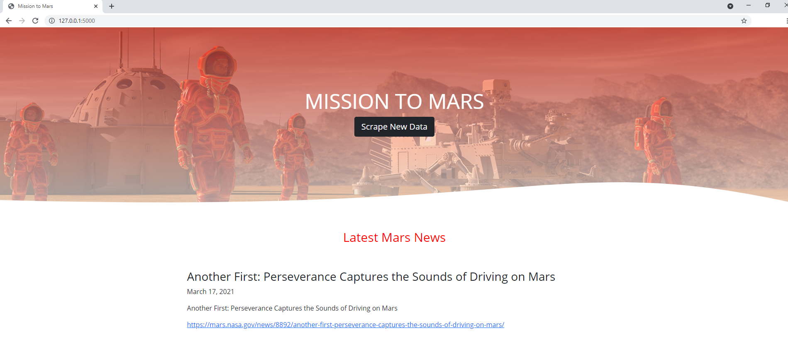
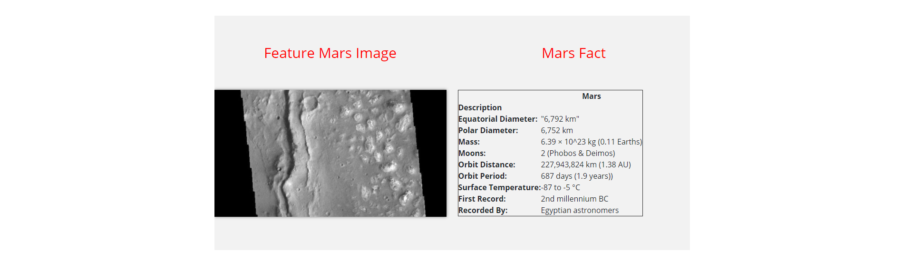
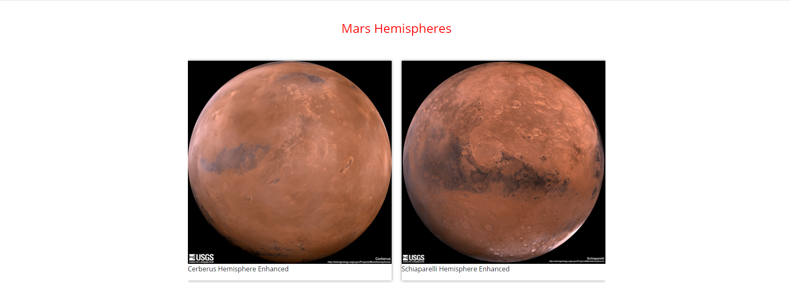
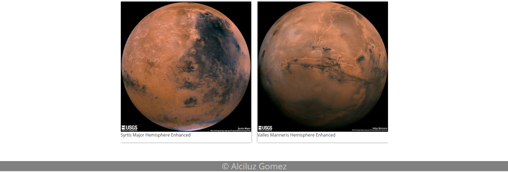

# web-scraping-challenge
## Mission to Mars

Build a web application that scrapes various websites for data related to the Mission to Mars and displays the information in a single HTML page. 

### NASA Mars News

* Scrape the [NASA Mars News Site](https://mars.nasa.gov/news/) and collect the latest News Title and Paragraph Text. Assign the text to variables that you can reference later.

### JPL Mars Space Images - Featured Image

* Visit the url for JPL Featured Space Image [here](https://data-class-jpl-space.s3.amazonaws.com/JPL_Space/index.html) and find the image url for the current Featured Mars Image

### Mars Facts

* Visit the Mars Facts webpage [here](https://space-facts.com/mars/) and  scrape the table containing facts about the planet including Diameter, Mass, etc.

### Mars Hemispheres

* Visit the USGS Astrogeology site [here](https://astrogeology.usgs.gov/search/results?q=hemisphere+enhanced&k1=target&v1=Mars) to obtain high resolution images for each of Mar's hemispheres.

